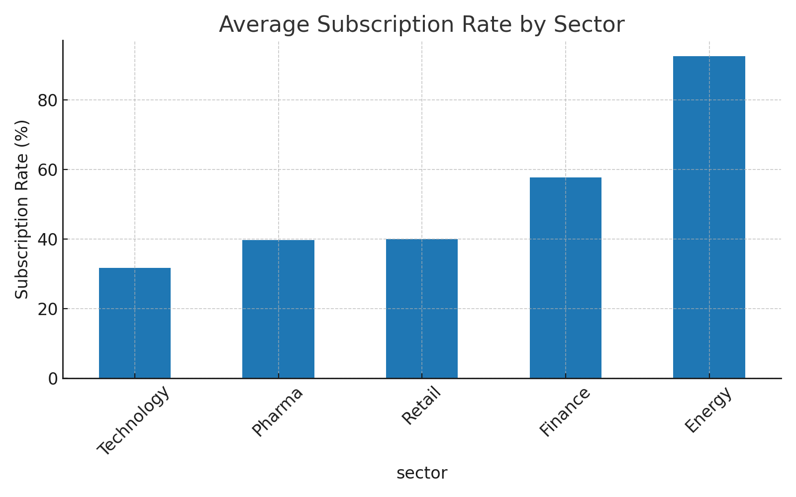
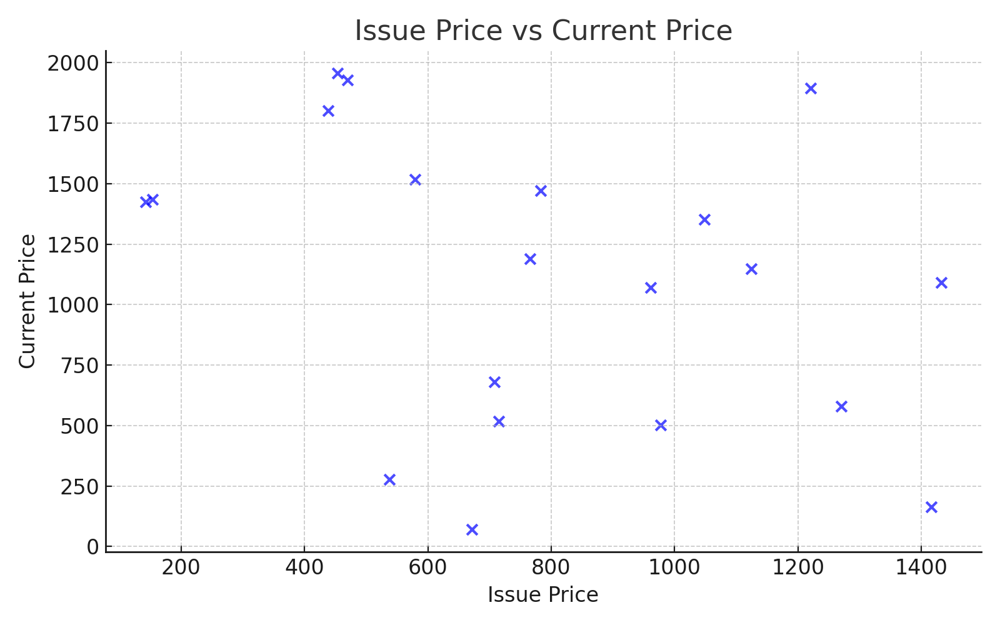
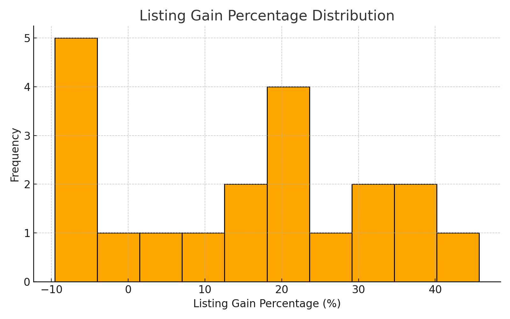

# IPO-Tracker-and-Predictor
Advanced SQL IPO Analytics – Track trends, predict gains, invest smarter.

## 📊 Visual Insights

### 1️⃣ Average Subscription by Sector

### 2️⃣ Issue Price vs Current Price

### 3️⃣ Listing Gain Distribution
